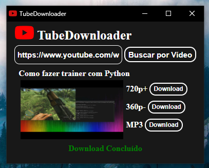

# TubeDownloader

## Instalação das Libs

python -m pip install -r requirements.txt

### `Crirar ".exe"`

1. python -m pip install pyinstaller
2. python -m eel main.py web --noconsole --onefile -i web/icon.ico

### `Executar`

python main.py

## Exemplo

